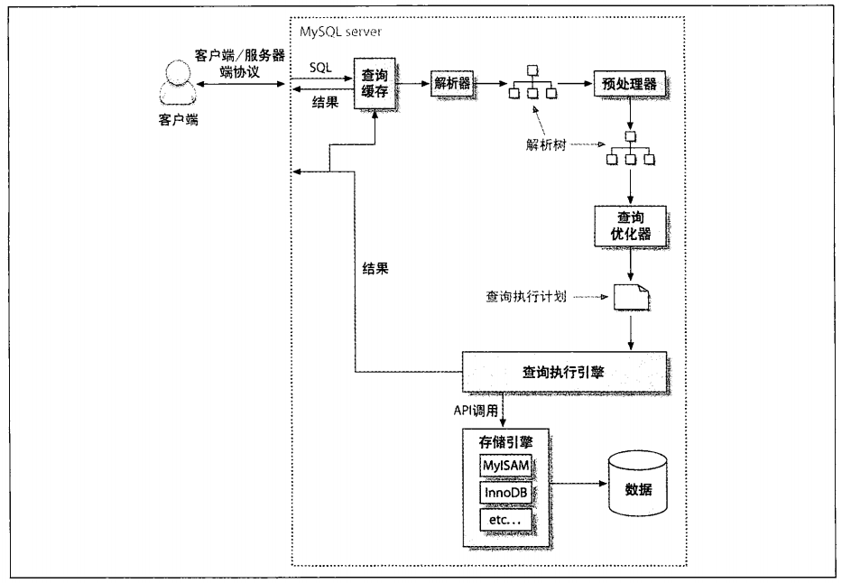

# Mysql 查询优化策略 #
---

&emsp;&emsp;这篇文章是自己对 ***《High Performance Mysql》*** 第六章 **查询性能优化** 的一个总结，其实网络上很多关于mysql查询优化的文章，然而这些文章中的大部分知识都是来自于《High Performance Mysql》这本经典之作。如果希望能够更好了解mysql相关知识，不妨买本《High Performance Mysql》。

&emsp;&emsp; ***查询优化，索引优化，库表结构的优化需要齐头并进，一个不落*** 。之后会写文章记录如何为高效的查询设计表和索引。

## 慢查询基础 ##

&emsp;&emsp;在编写快速的查询之前，需要清楚一点，真正重要的是响应时间。了解查询的生命周期，清楚查询的时间消耗情况对于优化查询有很大的意义。

&emsp;&emsp;查询性能低下最基本的原因是访问的数据太多。对于低效的查询，下面两个步骤来分析总是有效的。

>1. 确认应用程序是否在检索大量超过需要的数据。这通常意味着访问了太多的行，但有时候也可能是方位太多的列。
>2. 确认 MySQL 服务器层是否在分析大量超过需要的数据行。

* 避免查询不需要的记录
* 每次看到 **SELECT \*** 的时候要用怀疑的眼光审视。取出全部的列，会让优化器无法完成索引覆盖扫描这类优化，还会带来额外的I/O、内存和CPU的消耗。一些DBA是禁止 **SELECT \*** 这类写法的。当然 **SELECT \*** 某些时候可以简化开发，如果清楚这样做的性能影响，这种做法是值得考虑的。
* 对于MySQL，最简单的衡量查询开销的三个指标如下：
    1. 响应时间
    2. 扫描的行数
    3. 返回的行数
* 在 EXPLAIN 语句中的 type 类型反应了访问类型。（会有专门文章描述 EXPLAIN 的使用）。
* 一般MySQL 使用三种方式应用where条件吗，从好到坏依次是：
    1. 在索引中使用where条件来过滤不匹配的记录。这是在存储引擎层完成的。
    2. 使用索引覆盖扫描（在 Extra 列中出现了 Using index）来返回记录，直接从索引中过滤不需要的记录并返回命中的结果。这是在MySQL服务层完成的，但无需再回表查询记录。
    3. 从数据表中返回数据，然后过滤不满足条件的记录（在 Extra 列中出现了 Using where）。这在MySQL服务层完成，MySQL需要先从数据表读出记录然后过滤。
* 如果发现查询需要扫描大量的数据但是只返回少量的行，那么通常可以通过下面的技巧去优化它。
    1. 使用索引覆盖扫描，把所有需要用的列都放到索引中，这样存储引擎就无需回表获取对应的行就可以返回结果了。
    2. 改变表结构。例如使用单独的汇总表。
    3. 重写这个复杂的查询，让MySQL 优化器能够以更优化的方式执行这个查询。（这篇文章的重点）
* 重构查询方式
    1. 能否把一个复杂的查询拆分成多个简单的查询
    2. 分解关联查询。有如下优势：
        + 让缓存更高效。
        + 查询分解后，执行单个查询可以减少锁竞争。
        + 在应用层关联，可以很容易的对数据库进行拆分，更容易做到高性能和可扩展。
        + 查询本身的效率也可能会有所提升。
        + 可以减少冗余记录的查询。
        + 更进一步，这样做相当于在应用中实现了哈希关联。某些场景哈希关联的效率要高很多。

## mysql查询的原理 ##
---

下图显示了查询的执行路径：

>1. 客户端发送一条查询给服务器。
>2. 服务器先检查查询缓存，如果命中了缓存，则立刻返回存储在缓存中的结果，否则进入下一阶段。
>3. 服务器端进行SQL解析、预处理，再由优化器生成对应的执行计划。
>4. MySQL 根据优化器生成的执行计划，调用存储引擎的 API 来执行查询。
>5. 将结果返回给客户端。

&emsp;&emsp;如果你google过sql执行原理相关的文章，那么上边的内容不会陌生，之后我会记录一些个人的理解。

1. 客户端发送一条查询给服务器。
    + 客户端发送数据包到服务端是有数量限制的。 **MySQL server has gone away** 错误可能的原因就是传输的数据量太大。 可以通过 **show variables like "max_allowed_packet"** 命令查看服务器允许传送的最大数据（单位是byte）。可以通过 **set global max_allowed_packet = 2\*10\*1024\*1024** 进行修改。
    + 查询状态，对于一个MySQL连接或者说一个线程，任何时刻都有一个状态，该状态表示MySql当前正在做什么。 可以使用 **SHOW FULL PROCESSLIST** 命令。
        + Sleep  线程正在等待客户端，以向它发送一个新语句
        + Query  线程正在执行查询或往客户端发送数据
        + Locked  该查询被其它查询锁定
        + Copying to tmp table on disk  临时结果集合大于tmp_table_size。线程把临时表从存储器内部格式改变为磁盘模式，以节约存储器
        + Sending data  线程正在为SELECT语句处理行，同时正在向客户端发送数据
        + Sorting for group  线程正在进行分类，以满足GROUP BY要求
        + Sorting for order  线程正在进行分类，以满足ORDER BY要求
2. 查询缓存（Query cache）。MySQL的查询缓存是通过一个对大小写敏感的哈希查找实现的。查询和缓存中的查询即使只有一个字节不同，那也不会匹配缓存。 因为一些原因，很多情况是会关闭MySQL的Query cache的，原因可以看[这里](http://imysql.com/2014/09/05/mysql-faq-why-close-query-cache.shtml)。可以通过 **set global query_cache_tyep=0** 和 **set global query_cache_size=0** 关闭 Query cache。同时，在存储引擎层面也会有自己的缓存策略。
3. 查询优化处理
    - 语法解析器和优化器，MySQL通过关键字将SQL进行解析，生成一颗对应的“解析树”。
    - 查询优化。 MySQL使用基于成本的优化器，它将尝试预测一个查询使用某种执行计划的成本，并选择其中成本最小的一个（其实经常mysql没有选择最优的执行计划，因此需要我们的优化）。可以通过 **show status like 'Last_query_cost'** 来得知MySQL计算的当前查询的成本。有很多原因会导致MySQL优化器选择错误的执行计划，这里就不罗列了，如果想要了解不妨买本《High Performance MySQL》细读一下。
    + MySQL能够处理的优化类型
        + 重新定义关联表的顺序。（也因为这点，关联查询结果的顺序是不定的。）
        + 将外连接转化成内连接。
        + 使用等价变换规则。
        + 优化count，min 和 max。
        + 预估并转化为常数表达式。
        + 覆盖索引扫描。
        + 子查询优化。
        + 提前终止查询。 使用limit的时候。在发现已经满足查询需求的时候，MySQL总是能够立刻终止查询。
        + 等值传播。如果两列上的值通过等式关联，那么MySQL能够把其中一个列的where条件传递到另一列上。
        + 列表in()的比较
    + MySQL如何执行关联查询。
    
    
    待续。。。